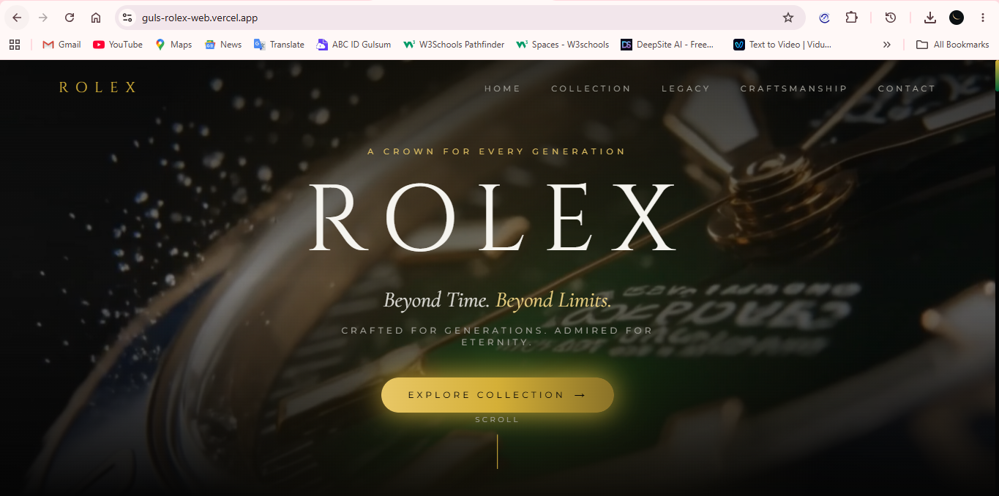
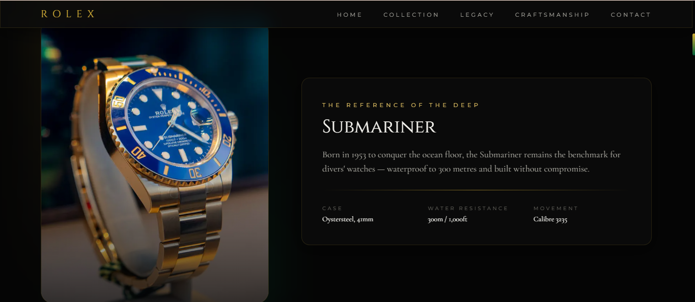
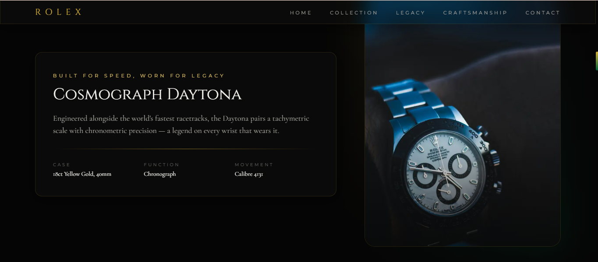
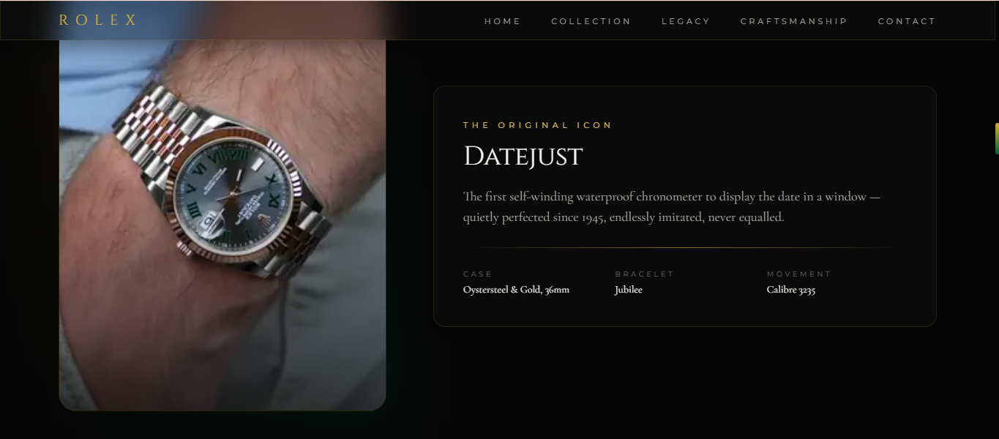
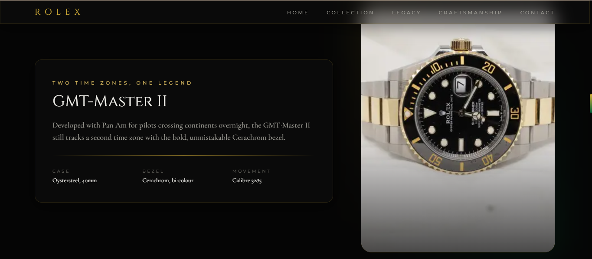
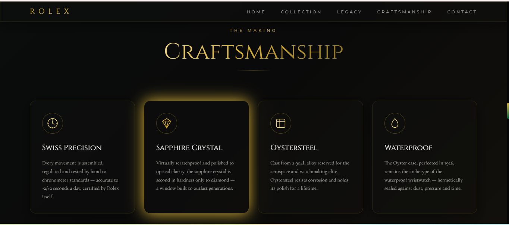
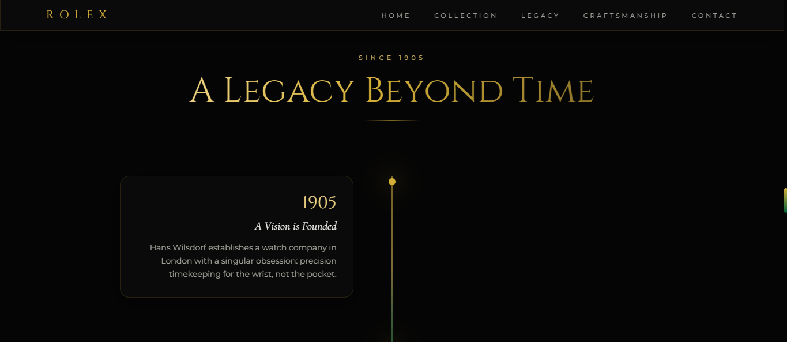
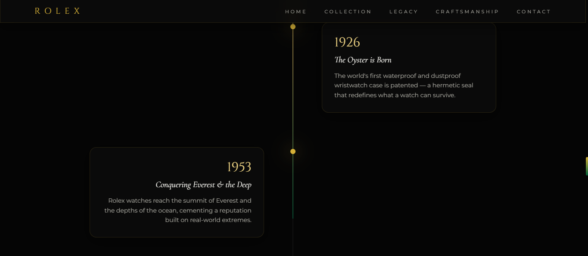
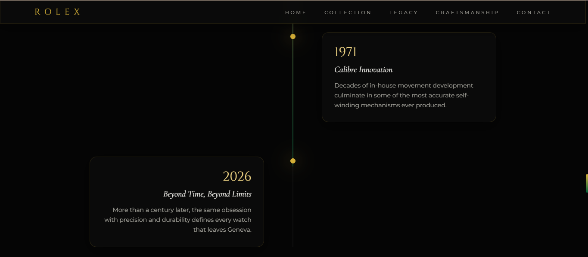
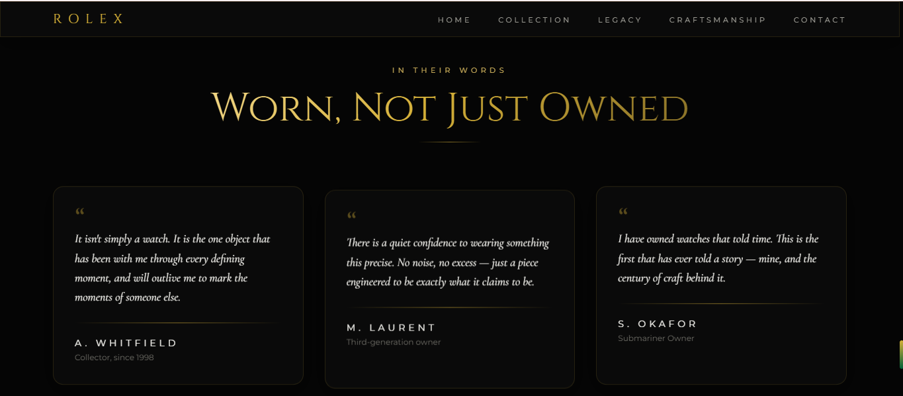

<div align="center">

# ⌚ ROLEX — Beyond Time. Beyond Limits.

### *A cinematic, Apple-keynote-grade luxury watch marketing site*

[](https://guls-rolex-web.vercel.app/)
[](https://nextjs.org/)
[](https://www.typescriptlang.org/)
[](https://tailwindcss.com/)
[](https://gsap.com/)

*Crafted for generations. Admired for eternity.*

<br/>


<sub>🎬 Full site walkthrough (hero → collection → craftsmanship → legacy → footer), compressed from screen recording. <a href="https://guls-rolex-web.vercel.app/">View it crisp on the live site →</a></sub>

</div>

<br/>

---

## ✨ Overview

This is a fully custom, motion-driven landing experience for **Rolex**, designed to feel less like a typical portfolio site and more like a premium product launch — the kind of polish you'd expect from an Apple keynote page, reimagined for Swiss horology.

Built with **Next.js 15 (App Router)** and **TypeScript**, every section is choreographed with **GSAP + ScrollTrigger**, buttery **Lenis** smooth scrolling, and subtle **Framer Motion** micro-interactions, wrapped in a moody obsidian-and-gold design language inspired by the brand itself.

> 🔗 **Live site:** [guls-rolex-web.vercel.app](https://guls-rolex-web.vercel.app/)

<br/>

## 🚀 Features

- 🎬 **Full-screen video hero** with a GSAP load-in timeline and parallax scroll
- 🖱️ **Cursor spotlight** — a fixed radial gradient that follows the pointer, driven by `requestAnimationFrame` for near-zero cost
- ✨ **Ambient particle field** rendered on a single `<canvas>` (not DOM nodes) for performance, and respects `prefers-reduced-motion`
- 🌀 **Lenis-powered smooth scrolling**, synced to GSAP's ticker so inertia and scroll-triggered animation never drift apart
- 💎 **The Collection** — four icons, each with its own story and spec sheet:
  - **Submariner** — *The Reference of the Deep* (Oystersteel, 41mm · 300m water resistance · Calibre 3235)
  - **Cosmograph Daytona** — *Built for Speed, Worn for Legacy* (18ct Yellow Gold, 40mm · Chronograph · Calibre 4131)
  - **Datejust** — *The Original Icon* (Oystersteel & Gold, 36mm · Jubilee bracelet · Calibre 3235)
  - **GMT-Master II** — *Two Time Zones, One Legend* (Oystersteel, 40mm · Cerachrom bi-colour bezel · Calibre 3285)
- 🛠️ **Craftsmanship section** — Swiss Precision, Sapphire Crystal, Oystersteel, and Waterproofing, told as an editorial story
- 🕰️ **Scroll-drawn Legacy timeline** tracing the brand from 1905 to 2026
- 👑 **The Lady's Edit** — an editorial split layout spotlighting the women's collection
- 💬 **Floating glass testimonial cards**
- 🪟 **Glassmorphic UI components** — sticky glass navbar, magnetic buttons, glass cards
- 📱 Fully responsive, with a dedicated mobile navigation menu

<br/>

## 🖼️ Preview

<div align="center">

### 🏠 Hero



<br/><br/>

### 💎 The Collection

| Submariner | Cosmograph Daytona |
|:---:|:---:|
|  |  |

| Datejust | GMT-Master II |
|:---:|:---:|
|  |  |

<br/>

### 🛠️ Craftsmanship



<br/><br/>

### 🕰️ Legacy — Since 1905





<br/><br/>

### 🦶 Footer



</div>

<br/>

## 🛠️ Tech Stack

| Layer | Technology |
|---|---|
| Framework | [Next.js 15](https://nextjs.org/) (App Router) |
| Language | [TypeScript](https://www.typescriptlang.org/) |
| Styling | [Tailwind CSS](https://tailwindcss.com/) |
| Scroll Animation | [GSAP](https://gsap.com/) + ScrollTrigger |
| Motion | [Framer Motion](https://www.framer.com/motion/) |
| Smooth Scroll | [Lenis](https://lenis.darkroom.engineering/) |
| Deployment | [Vercel](https://vercel.com/) |

<br/>

## 🎨 Design System

A restrained, jewel-toned palette anchored in obsidian and gold — built to feel expensive without trying too hard.

| Token | Swatch | Value | Use |
|---|:---:|---|---|
| `obsidian` |  | `#050505` | Primary background |
| `emerald` |  | `#006039` | Secondary accent, glass tints |
| `gold` |  | `#D4AF37` | Primary accent — CTAs, dividers, text gradients |
| `bone` |  | `#F5F4EF` | Primary text on dark |

**Typography**

| Role | Font |
|---|---|
| Display *(wordmark, large numerals)* | [Cinzel](https://fonts.google.com/specimen/Cinzel) |
| Serif *(headlines, quotes, italics)* | [Cormorant Garamond](https://fonts.google.com/specimen/Cormorant+Garamond) |
| Sans *(nav, labels, body, uppercase tracking)* | [Montserrat](https://fonts.google.com/specimen/Montserrat) |

All tokens live in `tailwind.config.ts`.

<br/>

## 📂 Project Architecture

```
app/
├─ layout.tsx                  → fonts, metadata, global providers
├─ page.tsx                    → assembles all sections
└─ globals.css                 → glass/spotlight/hairline utilities, base styles

components/
├─ layout/
│  ├─ Navbar.tsx                → sticky glass nav, GSAP fade-in, mobile menu
│  ├─ Footer.tsx                 → social links, sitemap
│  ├─ SmoothScrollProvider.tsx    → Lenis + GSAP ticker/ScrollTrigger sync
│  ├─ CursorSpotlight.tsx          → fixed radial gradient that follows the pointer
│  └─ ParticlesField.tsx            → ambient gold/emerald dust on canvas
│
├─ sections/
│  ├─ Hero.tsx                   → full-screen video hero, GSAP load timeline + parallax
│  ├─ Collection.tsx              → Submariner / Daytona / Datejust / GMT-Master II
│  ├─ Craftsmanship.tsx            → Swiss Precision / Sapphire Crystal / Oystersteel / Waterproof
│  ├─ Legacy.tsx                   → scroll-drawn timeline since 1905
│  ├─ LuxuryWoman.tsx               → editorial split layout
│  └─ Testimonials.tsx               → floating glass cards
│
└─ ui/
   ├─ GlassCard.tsx
   ├─ MagneticButton.tsx
   └─ SectionHeading.tsx

lib/
├─ data.ts                      → all copy/content in one place
└─ gsap.ts                      → registers ScrollTrigger once, client-safe

types/
└─ index.ts                     → shared TypeScript interfaces

public/
├─ videos/rolex-hero.mp4         → hero background video
└─ images/hero-poster.jpg        → poster frame shown before video loads
```

<br/>

## ⚡ Getting Started

**Prerequisites:** Node.js 18+ and npm

```bash
# Clone the repo
git clone https://github.com/GulsumBegam/rolex-website.git
cd rolex-website

# Install dependencies
npm install

# Run the dev server
npm run dev
```

Then open [http://localhost:3000](http://localhost:3000) in your browser.

**Production build:**

```bash
npm run build
npm run start
```

> **📌 Note on fonts:** This project uses `next/font/google` (Cinzel, Cormorant Garamond, Montserrat), which self-hosts fonts at build time. The **first** `npm run build` / `npm run dev` requires internet access to fetch the font files — after that, they're cached locally and there are zero runtime requests to Google.

<br/>

## ⚠️ Before You Ship This Publicly

Watch and editorial imagery currently uses Unsplash placeholders (see `lib/data.ts`). Swap every `image` URL for **licensed Rolex photography** before deploying this to a real audience — both for legal compliance and brand accuracy. Rolex is a registered trademark; this project is an unofficial, fan-made concept build and is not affiliated with, endorsed by, or sponsored by Rolex SA.

<br/>

## 🗺️ Roadmap

- [ ] Swap placeholder imagery for licensed photography
- [ ] Add a CMS layer for editable copy (Sanity / Contentful)
- [ ] Internationalization (i18n)
- [ ] Lighthouse performance pass for the particle/video hero
- [ ] CI pipeline with type-check + build verification on PRs

<br/>

## 📄 License

This project is built for educational and portfolio purposes. All Rolex trademarks, names, and imagery rights belong to their respective owners.

<br/>

<div align="center">

**[🌐 View Live Site](https://guls-rolex-web.vercel.app/)** · **[💻 Source Code](https://github.com/GulsumBegam/rolex-website)**

*Designed & built by [Gulsum Begam](https://github.com/GulsumBegam)*

</div>
